**Langkah-langkah Membuat Repository, Markdown, Profile Readme, dan Fitur-Fitur Github**

**A. Langkah-Langkah Membuat Repository di Github**
1. Buka github dan login ke akun github
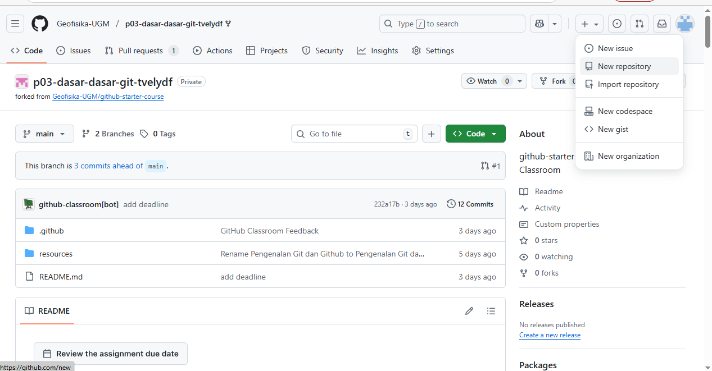

2. Klik tanda "+" pada bagian kanan atas. kemudian pilih "New Repository"
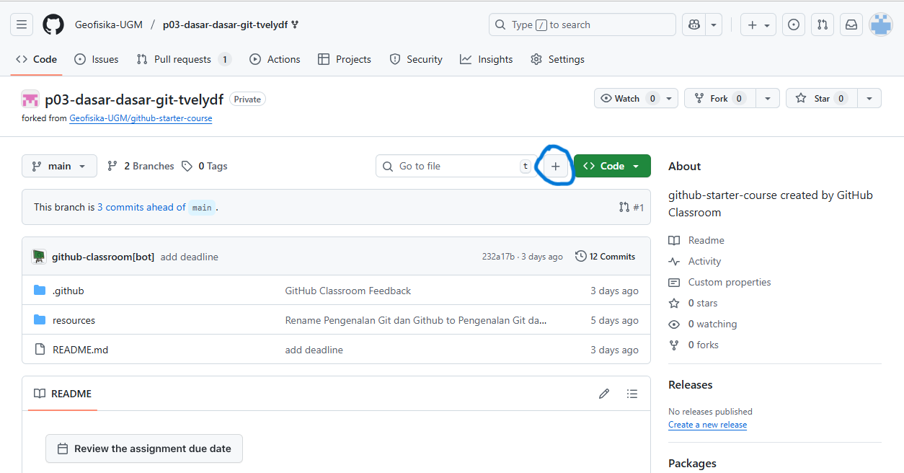

3. Setelah pilih "New Repository" maka akan muncul tampilan seperti dibawah ini. kemudian isi Repository name, Description, pilih visibility public, dan aktifkan README. 
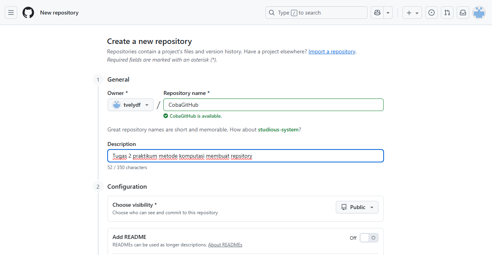

4. jika langkah ke 3 sudah dilakukan, selanjutnya klik "Create Repository"
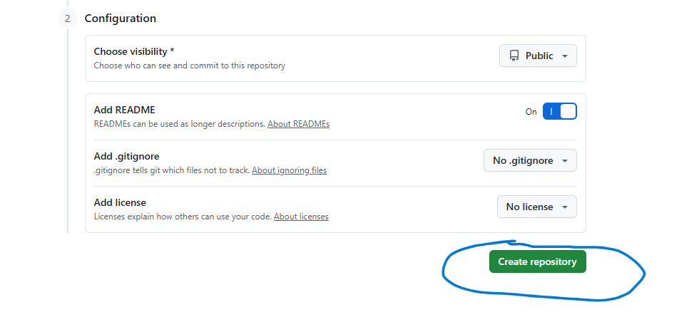

5. Setelah itu, akan muncul tampilan new repository yang sudah dibuat tadi
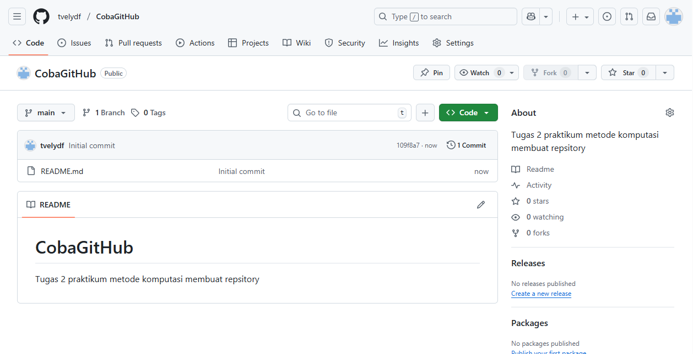

**B. Langkah-Langkah Membuat README, MARKDOWN,dan Fitur Menambahkan Gambar ke Repository**

**B.1. Menambahkan Repository ke File untuk Dimasukkan ke VS Code**
1. Buka "Anaconda Prompt", maka akan muncul tampilan seperti dibawah ini
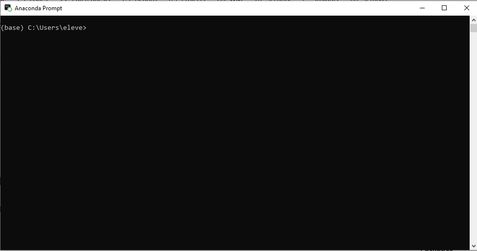

2. ketik "dir" kemudian enter. setelah itu, pilih folder penyimpanan yang diinginkan dengan cara ketik 'cd "nama folder"'

3. Jika sudah, buka kembali github kemudian klik "code" dan salin link repository
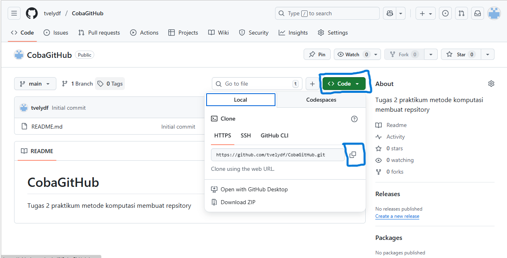

4. Kemudian kembali ke anaconda prompt,dan ketik "git clone 'tempel link repository'"
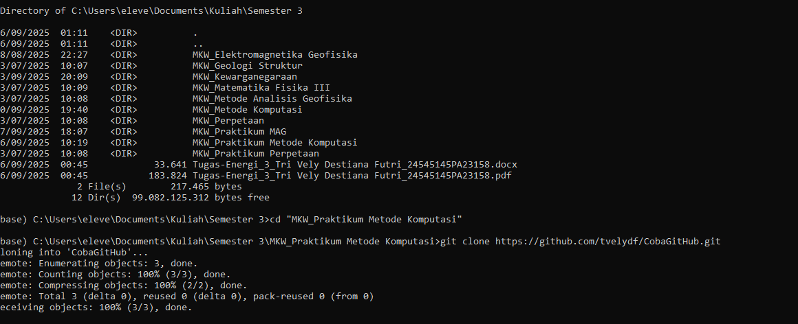

5. selanjutnya, ketik "dir" dan enter, kemudian pilih folder repository yang telah dibuat tadi, ketik 'cd "nama repository"'. kemudian ketik 'git config --global user.email "ketik email yg digunakan"' dan enter. setelah itu ketik "git init".
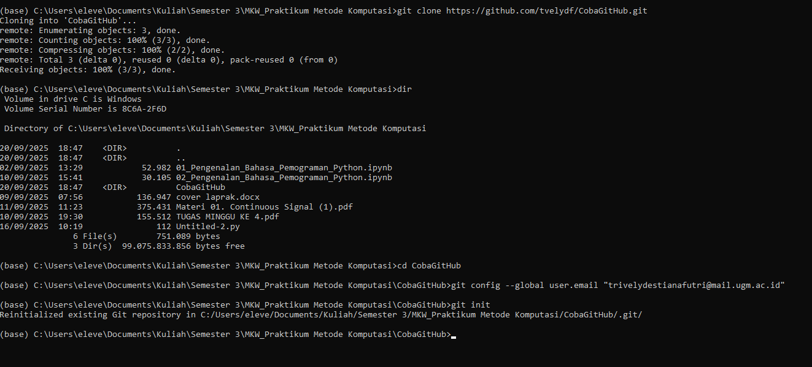

**B.2. Membuat README**
1. Buka VS Code, kemudian klik menu "file" pada bagian pojok kiri atas. kemudian klik "open folder"
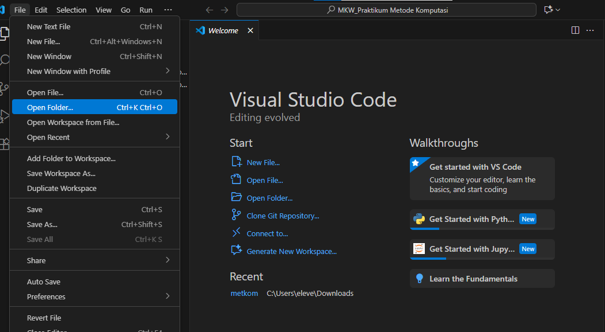

2. kemudian, pilih folder repository yang sudah dibuat lalu klik select
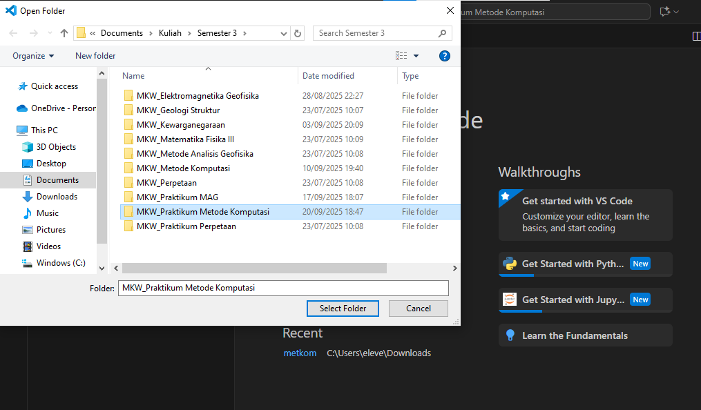

3. setelah itu, klik README.md dan isi profil README sesuai yang diinginkan
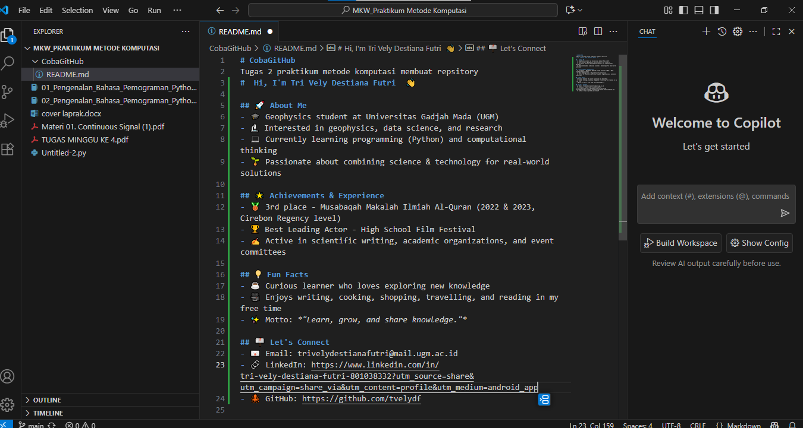

4. kemudian save
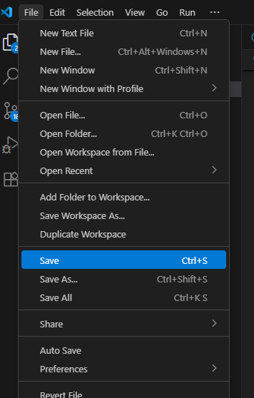

**B.3. Membuat MARKDOWN dan Fitur Menambahkan Gambar Ke Repository**
1. Klik New File dan beri nama pada file markdown. contoh: tugas 1 prak metkom.md
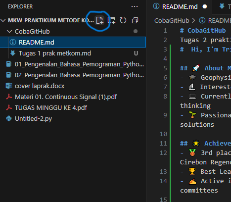

2. Kemudian, klik "New Folder" dan berikan nama untuk folder tersebut dan upload foto yang ingin dimasukkan. 

3. Untuk menambahkan gambar, kembali ke VS Code lalu ketik apapun yang ingin ditambahkan dan untuk menambahkan gambar ketik 

4. setelah itu, save.  

5. kemudian, buka anaconda prompt, masuk ke folder project dengan mengetik cd (folder project). 

6. kemudian klik git add .

7. lalu, git commit -m "link code repository"

8. kemudian ketik git push origin main

9. kemudian, buka kembali repository github dan cek apakah sudah terupload atau belum
